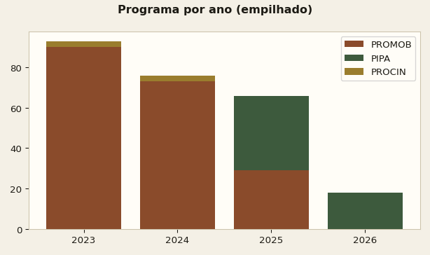
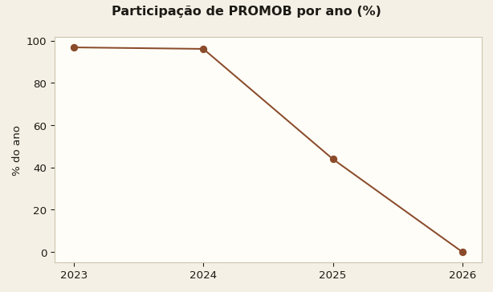
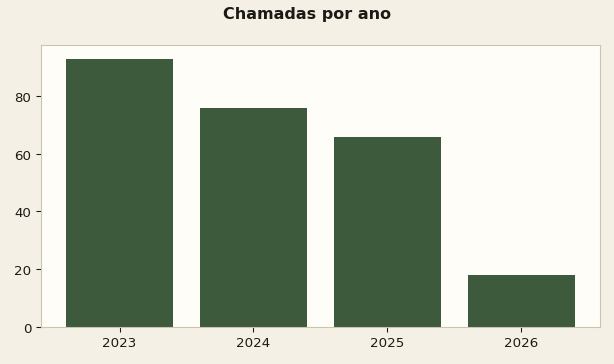
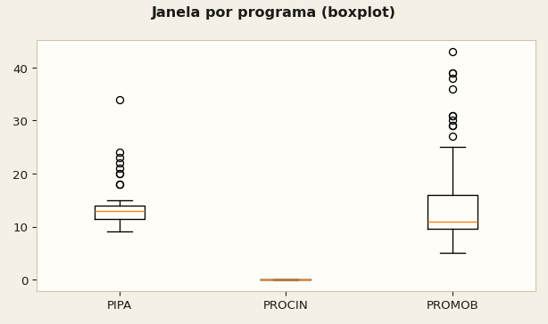
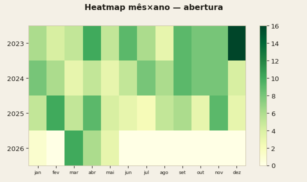
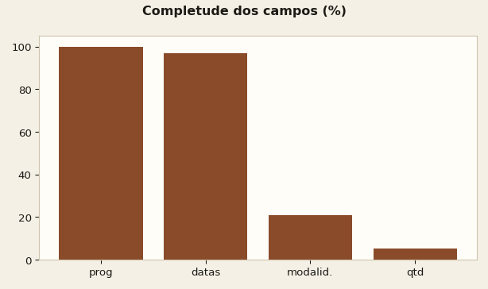
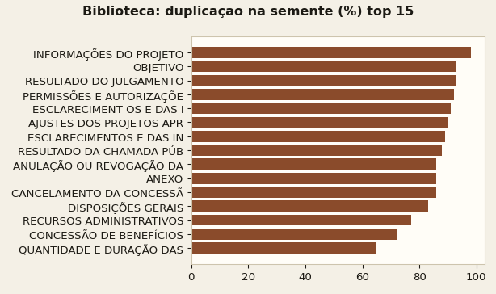
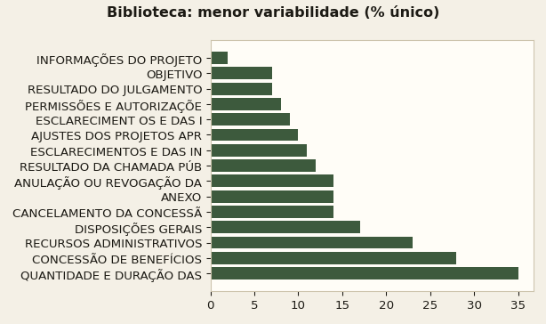
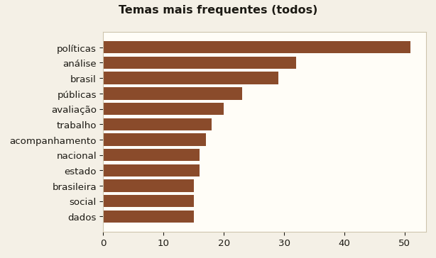

# Analytics do corpus IPEA/PIPA — os achados mais interessantes

A varredura completa gerou **102 gráficos** (`analytics/charts/`, reproduzível com
`python scripts/generate_charts.py` — veja `analytics/index.md`). Abaixo estão os
**10 mais informativos**, com a leitura honesta de cada um.

> Base: 253 chamadas raspadas do portal IPEA (2023–2026) + biblioteca de cláusulas.
> A versão limpa é gerada pelo pipeline em `scripts/`; a semente bruta fica em `data/raw/`.

---

## 1. A virada estrutural PROMOB → PIPA (o achado principal)




O sinal mais forte de todo o dataset. O **PROMOB** (mobilização de pesquisadores)
respondia por **97% das chamadas em 2023 e 96% em 2024**, despencou para **44% em
2025** e **zerou em 2026**. O **PIPA** só aparece em 2025 (37 chamadas) e domina 2026.

**Por que importa:** o construtor de minutas do app é *hardcoded* para
"CHAMADA PÚBLICA IPEA/PIPA". Ou seja, ele mira o programa que é **minoria histórica**
(22% do corpus) e ignora o PROMOB, que dominou o período. Recomendação derivada:
parametrizar o gerador por programa.

## 2. Volume de chamadas em queda — e 2026 incompleto



93 (2023) → 76 (2024) → 66 (2025) → 18 (2026). A queda é real, mas **2026 é parcial**
(snapshot de ~junho/2026). Não leia o último ponto como colapso — leia como recorte.

## 3. PROCIN é outro animal: janela de inscrição ≈ 0 dia



A janela de inscrição mediana é de **12 dias** (PIPA bem concentrado em ~12; PROMOB mais
disperso, com caudas até 43 dias). Já o **PROCIN tem janela ≈ 0** — coerente com um
processo simplificado/por convite, não uma seleção aberta. Tratar PROCIN como "chamada
aberta" nas análises é enganoso.

## 4. Sazonalidade: pico de fim de ano e 1º semestre



Sem estação dominante, mas há um **pico em dezembro/2023** (16 aberturas — corrida
orçamentária de fim de ano) e concentração no 1º semestre. 2026 quase vazio confirma o
recorte parcial.

## 5. Honestidade: metade dos campos "ricos" não existe



`url/título/ano/programa` = 100%, datas = 97%, mas **`modalidade` = 21%** e
**`qtd. de bolsas` = 5%**. **Consequência direta:** qualquer análise de "número de
bolsas", "valor por modalidade" ou "volume financeiro" seria inventada — por isso a aba
de Analytics do app *não* a apresenta. Honestidade > gráfico bonito.

## 6–7. A biblioteca de cláusulas estava ~metade duplicada




Na semente, **48% das cláusulas eram cópias exatas** dentro da própria categoria —
várias seções passavam de **90%** (ex.: "INFORMAÇÕES DO PROJETO" ≈ 98%). Os rótulos
truncados ("ESCLARECIMENT OS E DAS I") mostram o lixo de OCR que o pipeline corrige.

A baixa variabilidade tem um lado útil: as categorias quase idênticas **são exatamente o
texto-modelo (boilerplate)** — a melhor matéria-prima para sugerir cláusulas no
construtor (foi o que integramos). As categorias de alta variabilidade (objeto,
requisitos) são as específicas de cada projeto.

A limpeza levou a biblioteca de **5.895 → 3.060 cláusulas** e **103 → 87 categorias**.

## 8. Do que o IPEA pesquisa: políticas públicas e avaliação



Os títulos dos projetos são dominados por **políticas / públicas / avaliação / análise /
Brasil / trabalho / social / dados** — um retrato fiel de uma agenda de economia aplicada
e avaliação de políticas públicas.

---

### Como reproduzir
```bash
python scripts/clean_corpus.py && python scripts/clean_biblioteca.py
python scripts/build_app_data.py && python scripts/validate_data.py
python scripts/generate_charts.py   # gera os 102 gráficos em analytics/charts/
```
